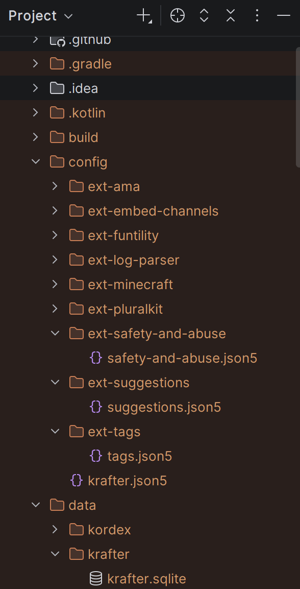

# Where are the config files??

You may have issues finding your volumes and exactly where
these config and data files are located. Because of this, we
compiled this short explanation on why this seems a little
scuffed and how to find your files.

## Volumes 101
When a Docker Container makes a new directory, it's saved in said container.
If you want these files to properly persist, though, this isn't something you
ideally want to happen. Because of this, Docker lets you declare 
[Volumes](https://docs.docker.com/engine/storage/volumes/) that contain these
files on the host disk rather than fully in a Container. If you paid attention
in the 
[introduction](../users/getting-started#run-through),
you may have seen that we declare the `/bot/data` and `/bot/config` volumes.
In the container, it has the following file structure:
```
\bot
 |data
 \config
```
However, these physical files are stored elsewhere on your host disk, in Docker's
Volumes directory. It can typically be found here:
```
/var/lib/docker/volumes
```
If you use Docker Desktop on Windows, you have to access it through WSL. Type the following
into your Explorer path:
```
\\wsl$\docker-desktop\mnt\docker-desktop-disk\data\docker\volumes
```
:::info
This goes for both Docker and Docker Compose.
:::

In this directory you will find folders with a bunch of random alphanumeric names,
these are your volumes. Every single one of these folders contains a `_data` folder,
which in its turn contains the contents of the Volume. Two of these contain the contents of the
`data` and `config` folders. **You have to manually find them.**

:::tip
If you can, use a tool like [WizFile](https://antibody-software.com/wizfile/download) 
to quickly find these folders.
:::info NOTE
This won't work for WSL!
:::

```
\volumes
 |47a...c73
 |046...d92
 |\_data
 | |ext-ama
 | |ext-embed-channels
 | |etc...
 |619...287
 |d40...40f
 \e60...745
  \_data
   |kordex
   \krafter
```

Files you edit here are reflected in the container that tries to access them.
:::warning
It is suggested to edit these files while the bot/container is not running, especially
the database found at `/krafter/krafter.sqlite`, because it could lead to corruption
if two things try to access them at the same time.
:::

### Why?
When we started working on this project, it was initially supposed to be bundled with our
MC → Discord linking mod, 
[Chat To Discord](https://github.com/Tywrap-Studios/chat-to-discord/tree/krafter), so we
opted for an easy-to-access way to configure the bot part of the mod.

Coincidentally, CTD already used BlossomBridge, much like all our other projects, and
so we also implemented all the module configs using that same API. When we realised
bundling the bot would make it too heavy and too hard to build, facing a lot of
errors relating to jar-in-jarring and dependencies, we let it go and made it an
independent piece of software opting to be able to link the bot to the mod via different
means, such as the proposed [CTD Protocol](../users/modules/ext-minecraft#the-ctd-protocol).

However, the config implementation stayed, and technically worked flawless. When you run
the bot in Dev Mode, it simply creates these as generic files and folders on your system:

With this in the back of our minds, we didn't think much of how it would differ when used 
on a VPS, VM or server using Docker.

The KordEx software supplies a Docker Gradle Plugin, which we use to generate the `Dockerfile`,
we assumed accessing Volumes wouldn't be that bad and added it to the `Dockerfile`. When
testing using Docker Desktop, we could edit the files using the built-in editor Docker
Desktop provides. 

Now, just for the record, we do not feel like changing this behaviour. Accessing the files
is not hard once you know the Volume ID they are stored in. If you have a fresh VPS
made purely for running this bot, there won't be many Volumes anyway, and if you do have
enough running on Docker that it would be a burden, we're sure you're seasoned enough to
find efficient ways to access and edit your files.

With that said, thank you for still using our software! You can continue to
look through the specific configs for the modules or look for something else.